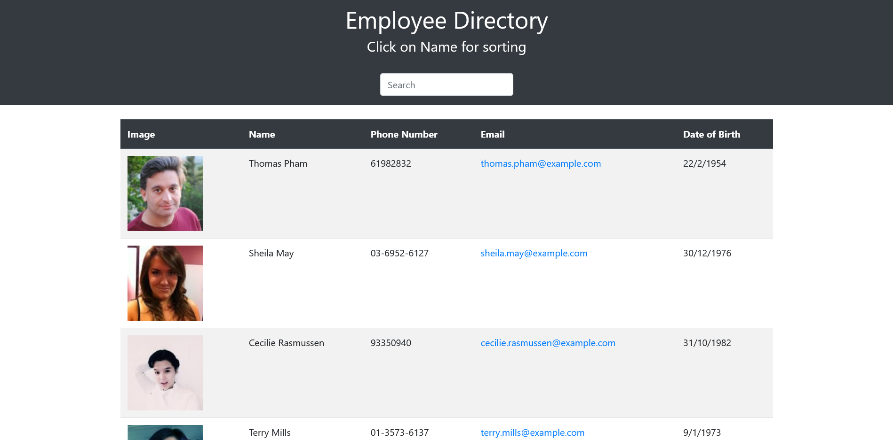

  # Title
  ## Employee Directory
  
  
  
  ## Table of contents 
  - [Description](#description)
  - [Installation](#installation)
  - [Usage Information](#usage-information)
  - [License](#license)
  - [Contribution Guidelines](#contribution-guidelines)
  - [Test Procedure](#test-procedure)
  - [Screenshot](#screenshot)
  - [deployed](#deployed)
  - [Questions](#questions)
  
  ## Description
     This application built by using react, bootstrap library. This application gets the employee data from API and shows the information of each employee in table with name, email, dob, phone no. and profile pic.
     user can see the employee details in rows of table.

  ## Installation
     first need to clone from given github link and need to perform 'npm i' on terminal within the project location. 
     Second, type on terminal 'npm start' to start the application

  ## Usage Information
     It is useful to observe employee information, user can sort the employee and also make search to find the specific employee.

  ## License
     MIT license
  
  ## Contribution Guidelines
     N/A

  ## Test Procedure
     N/A
  
  ## Screenshot
  ### welcome Screen
  

  ## deployed
  This application is deployed on github pages, 
  to see running application simply go through this link : [user directory](https://sthasub.github.io/Employee-Directory/)
  
  ## Questions
    if you have questions then please feel free to contact on these addresses,
  
  Github: [SthaSub](https://github.com/SthaSub)
  
  Email: [subhashshrestha3@gmail.com](subhashshrestha3@gmail.com)
    